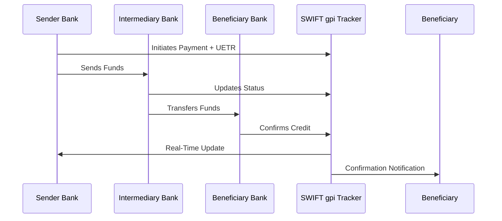
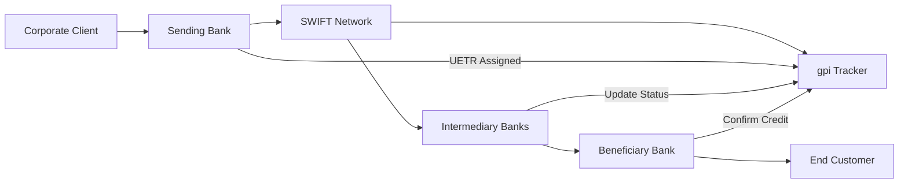
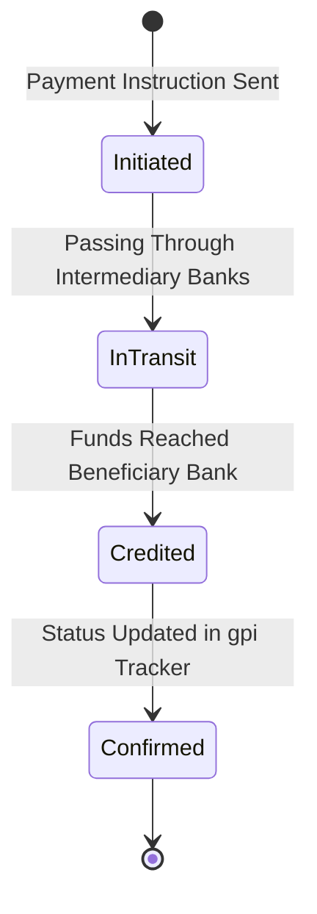
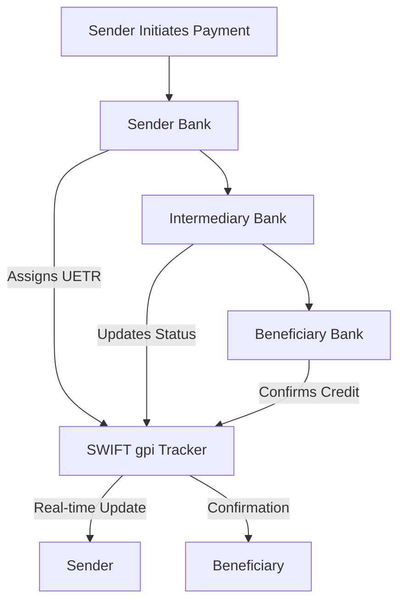

<h1 align="center">🌍 SWIFT GPI (Global Payments Innovation)</h1>

<p align="center">
  <a href="https://opensource.org/licenses/MIT"></a>
  <a href="https://github.com/kongali1720/SWIFT-GPI-Tracker/stargazers"></a>
  <a href="https://github.com/kongali1720/SWIFT-GPI-Tracker/network"></a>
  <a href="https://github.com/kongali1720/SWIFT-GPI-Tracker/issues"></a>
  <a href="https://github.com/kongali1720/SWIFT-GPI-Tracker/commits"></a>
  <a href="https://github.com/kongali1720/SWIFT-GPI-Tracker"></a>
</p>

<p align="center">
  
</p>


<p align="center">
  
</p>

---

## 📌 Overview
**SWIFT gpi (Global Payments Innovation)** is an industry standard developed by SWIFT to improve the speed, transparency, and traceability of cross-border payments.  
It enables banks and financial institutions to provide **real-time visibility** on international transactions, ensuring faster settlements and higher customer satisfaction.

💡 *Every bank involved is required to update the transaction status in the SWIFT gpi Tracker. This ensures that both the sender and the beneficiary can monitor the movement of funds in real time.*

---

## 🚀 Key Features
- **Speed**: Same-day or near-instant international payments.  
- **Transparency**: Clear visibility of fees and charges across the payment chain.  
- **Traceability**: End-to-end payment tracking with a unique reference (UETR).  
- **Certainty**: Confirmation when funds are credited to the beneficiary’s account.  

---

## 🔑 Core Components
1. **gpi Tracker**  
   - A centralized cloud-based database maintained by SWIFT.  
   - Tracks transactions end-to-end across multiple banks.  

2. **Unique End-to-End Transaction Reference (UETR)**  
   - A UUID assigned to every transaction, enabling real-time tracking.  

3. **gpi Directory**  
   - A global database of gpi-enabled banks and financial institutions.  

---

## 📊 How It Works
1. The sender initiates a cross-border payment via their bank.  
2. Each intermediary bank updates the payment status in the **SWIFT gpi Tracker**.  
3. The transaction can be monitored in real-time using the **UETR**.  
4. Both the sender and beneficiary are notified once the funds are credited.  

---

## ✅ Benefits for Stakeholders
### For Banks:
- Improved customer experience.  
- Reduced inquiries about payment status.  
- Compliance with global payment standards.  

### For Corporates:
- Faster payments to suppliers.  
- Transparent view of costs and deductions.  
- Improved liquidity management.  

---

## 📖 Example Flow


### 🏗️ gpi System Architecture


### 🔄 Transaction Lifecycle


### 📊 Traditional SWIFT vs SWIFT gpi

| Feature                 | Traditional SWIFT | SWIFT gpi                |
| ----------------------- | ----------------- | ------------------------ |
| **Speed**               | 2–5 days          | Same-day / near-instant  |
| **Transparency**        | Limited           | Full fee & FX visibility |
| **Traceability**        | No tracking       | End-to-end UETR tracking |
| **Certainty**           | No confirmation   | Confirmation of credit   |
| **Customer Experience** | Low               | High                     |

---


| 🌐 Real-World Use Cases | 📌 Compliance & Standards |
|-------------------------|---------------------------|
| **Corporate Treasury**: Monitoring supplier payments and ensuring funds are received on time. | **ISO 20022** messaging standards |
| **Banks**: Reducing customer inquiries about payment status. | Integrated with **SWIFTNet** for secure communication |
| **Fintechs**: Building value-added services on top of SWIFT gpi data. | Supports transparency & **AML (Anti-Money Laundering)** requirements |
| **Regulators**: Ensuring compliance, transparency, and fraud detection. | Ensures regulatory reporting & global interoperability |

---

---

## 🏦 Additional Insights on SWIFT gpi

### 🌍 Global Adoption
- More than **4,000 banks worldwide** are live with SWIFT gpi.  
- Covers **over 85% of all cross-border payments**.  
- Growing adoption in **emerging markets** to improve financial inclusion.  

### 🔗 Integration with ISO 20022
- SWIFT gpi is fully aligned with **ISO 20022**, the new global standard for financial messaging.  
- Ensures structured, richer, and more accurate payment data.  
- Enhances automation in reconciliation and compliance checks.  

### 📡 Technology & Infrastructure
- Runs on **SWIFTNet**, a secure, private global financial network.  
- **Cloud-based gpi Tracker** enables 24/7 availability and real-time updates.  
- Open APIs allow **fintechs and corporates** to integrate directly into ERP/TMS systems.  

### ⚖️ Compliance & Security
- Designed to meet stringent **AML (Anti-Money Laundering)** and **KYC (Know Your Customer)** regulations.  
- Provides an **audit trail** of every payment event across the transaction chain.  
- Increases transparency, reducing risks of fraud or delays.  

### 🚀 Future of Cross-Border Payments
- SWIFT is extending gpi to support **instant payments** by connecting with domestic real-time payment systems.  
- Moves towards **24/7/365 availability**, eliminating cut-off times.  
- Strengthens collaboration with **CBDCs (Central Bank Digital Currencies)** and digital asset initiatives.  

---

## 📖 Extended Example Flow with Transparency


---

## 🔍 Deep Dive: How SWIFT gpi Works  

SWIFT gpi is not just a faster version of traditional SWIFT messaging. It’s a **paradigm shift** in global payments with these key components:  

1. **Unique End-to-End Transaction Reference (UETR)**  
   - Every payment message carries a unique identifier (UUID-based).  
   - Enables real-time tracking from the sending bank to the receiving bank.  
   - Works like a “parcel tracking number” for international payments.  

2. **SWIFT gpi Tracker**  
   - A centralized database hosted by SWIFT.  
   - All participating banks must update payment status in real time.  
   - Both senders and receivers can query the Tracker to see the payment journey, fees, FX rates, and confirmation of credit.  

3. **Service-Level Agreements (SLAs)**  
   - gpi members commit to same-day settlement for many corridors.  
   - Ensures predictable processing time and customer trust.  
   - Provides measurable accountability across the payment chain.  

4. **Integration with Back-Office Systems**  
   - APIs and ISO 20022 XML messages allow banks and corporates to plug gpi directly into ERPs and treasury systems.  
   - Improves reconciliation, liquidity forecasting, and automation.  

---

## 🌍 Industry Impact  

| Stakeholder          | Benefit from SWIFT gpi                                                                 |
|----------------------|-----------------------------------------------------------------------------------------|
| **Corporates**       | Real-time visibility, better liquidity management, reduced disputes with suppliers.     |
| **Banks**            | Lower operational costs, fewer inquiries, improved customer satisfaction.                |
| **Fintechs**         | Access to real-time payment data to build analytics, dashboards, and new services.      |
| **Regulators**       | Transparent audit trail, better compliance with AML/CTF rules, and cross-border control. |

---

## ⚙️ Technical & Governance Layers  

- **Technology Stack**  
  - Built on **SWIFTNet** with secure FIN and InterAct messaging.  
  - Fully aligned with **ISO 20022** for structured, rich data.  
  - Cloud-enabled API access for corporates and fintechs.  

- **Governance**  
  - Overseen by the SWIFT gpi **Rulebook** and participating banks.  
  - Strict SLA monitoring and performance reporting.  
  - Ensures **global standardization** across 11,000+ institutions.  

---

## 🚀 The Bigger Picture  

- SWIFT gpi is a **step toward instant cross-border payments**.  
- It directly competes with blockchain-based solutions (like Ripple, Stellar) by providing **trust, standardization, and compliance** at a global scale.  
- Adoption has been rapid:  
  - Over **60% of cross-border payments** are now sent via gpi.  
  - Covering more than **150 currencies** and **4,000 financial institutions**.  

---

✅ With SWIFT gpi, the vision of a **“truly global, transparent, and real-time payment ecosystem”** is no longer a future dream — it’s already here.  


## 🛠️ Technical Setup (High-Level)

### Membership & Connectivity
- Bank / institution must be a **SWIFT member**.  
- Needs a **SWIFTNet connection** (via Alliance Lite2, Alliance Access, or cloud connection providers).  
- Obtain **credentials + certificates** from SWIFT.  

### APIs & SDKs
- SWIFT provides **gpi Tracker APIs**.  
- Delivered via **SWIFT Developer Portal** (requires NDA & membership).  
- Exposed as **RESTful APIs** secured with **OAuth2 + PKI certificates**.  

### Integration
- Corporate treasury or bank systems integrate with **ISO 20022 MX messages**.  
- Typically via **back-office integration software** (Temenos, Finastra, FIS, SAP Treasury, etc.).  

---

## ⚙️ Simulation (Open Approach)

Since the real SWIFT gpi network is **closed**, we can **simulate** the environment for learning:

### ISO 20022 Message Simulation
- Create XML messages such as `pacs.008` (Payment Initiation) & `pacs.002` (Status Report).  
- Use **Python/Java + XML libraries** for parsing & validation.  

### Tracking Simulation
- Build a **local database** (Postgres / MySQL) to store transaction statuses.  
- Assign a **UETR (UUID v4)** for each transaction.  
- Update statuses such as `Received`, `Processing`, `Credited`.  
- Expose via **Flask/FastAPI** as a *mock SWIFT gpi Tracker API*.  

---

## 💻 Installation Guide (Mock Tracker)

### 1️⃣ Clone Repository
```bash
git clone https://github.com/kongali1720/SWIFT-GPI.git
cd SWIFT-GPI
```

### 2️⃣ Create Virtual Environment
```bash
python3 -m venv venv
source venv/bin/activate   # On Windows: venv\Scripts\activate
```

### 3️⃣ Install Dependencies
```bash
pip install fastapi uvicorn pydantic sqlite-utils
```

### ▶️ Run the Mock Tracker
```bash
uvicorn mock_tracker:app --reload
```

Now open in your browser:
👉 http://127.0.0.1:8000/docs

This will give you an interactive API Explorer (Swagger UI) where you can test endpoints in real time. 🚀

### ⚡ Quick Test with cURL

Untuk cek apakah API jalan:
```bash
curl -X GET "http://127.0.0.1:8000/transactions" -H "accept: application/json"
```


---

<h3 align="center" style="color:#39ff14; font-size:1.5rem;">
💡 ☕ Traktir Kopi & Nasi Padang / Nasi Gorengnya ya cuy! 😄
</h3>

<div align="center">

<p style="color:#ffffff; font-size:1.1rem;">
Dukung terus biar semangat bikin karya edukatif lainnya...  
Keep supporting so I stay motivated to create more educational works!
</p>

<a href="https://www.paypal.com/paypalme/bungtempong99" target="_blank" style="text-decoration:none;">
  
</a>

<p style="color:#39ff14; font-size:1rem; margin-top:8px;">
Support with ☕ so I can buy 🍜 and keep being 🧠!
</p>

</div>

---

<h2 align="center" style="color:#39ff14;">📫 Let’s Connect together</h2>

<p align="center">
  <a href="https://github.com/kongali1720" target="_blank">
    
  </a>
  <a href="mailto:admin@kongali1720.com">
    
  </a>
  <a href="https://discord.gg/dXM88zFU" target="_blank">
    
  </a>
  <a href="https://www.instagram.com/kongali1720/" target="_blank">
    
  </a>
</p>

<p align="center">
  <a href="https://x.com/Kongali1720" target="_blank">
    
  </a>
  <a href="https://younext.cloud" target="_blank">
    
  </a>
  <a href="https://kongali1720.com" target="_blank">
    
  </a>
  <a href="https://wa.me/447440014278" target="_blank">
    
  </a>
</p>

<h3 align="center" style="color:#ff69b4;">❤️ 💻 INITIATING HUMANITY MODE... for Down Syndrome ❤️</h3>

<div align="center">

<table style="margin: 0 auto; border-collapse: collapse; box-shadow: 0 4px 10px rgba(0,0,0,0.2); border-radius: 8px; overflow: hidden;">
  <thead style="background-color:#ff69b4; color:white;">
    <tr>
      <th style="padding: 12px 25px; font-size: 18px;">Item</th>
      <th style="padding: 12px 25px; font-size: 18px;">Keterangan / Description</th>
    </tr>
  </thead>
  <tbody style="background-color:#1a1a1a; color:#39ff14;">
    <tr>
      <td style="padding: 12px 25px;">🎯 Target</td>
      <td style="padding: 12px 25px;">Anak-anak Pejuang Down Syndrome / Kids with Down Syndrome</td>
    </tr>
    <tr>
      <td style="padding: 12px 25px;">📡 Status</td>
      <td style="padding: 12px 25px;">Butuh Dukungan / Needs Support</td>
    </tr>
    <tr>
      <td style="padding: 12px 25px;">🧠 Response</td>
      <td style="padding: 12px 25px;">Buka Hati + Klik Link = Satu Senyum Baru / Open Heart + Click Link = One New Smile</td>
    </tr>
  </tbody>
</table>

<p align="center" style="margin-top:15px; color:white; font-size:1rem;">
Mereka bukan berbeda — mereka dilahirkan untuk mengajarkan dunia tentang cinta yang murni dan kesabaran yang luar biasa.<br>
They are not different — they were born to teach the world pure love and extraordinary patience.
</p>

<p align="center" style="margin-top: 15px;">
  <a href="https://mydonation4ds.github.io/" target="_blank" style="display: inline-block; text-decoration:none;">
    
  </a>
</p>

---

<section align="center" style="font-family: Arial, sans-serif;">

<h2 style="margin-bottom: 15px; color: #0070f3;">💳 Dukungan Pembayaran</h2>

<table align="center" style="margin: 0 auto; border-collapse: collapse; border-radius: 8px; overflow: hidden;">
  <thead style="background-color: #0070f3; color: white;">
    <tr>
      <th style="padding: 10px 20px; font-size: 16px;">Visa</th>
      <th style="padding: 10px 20px; font-size: 16px;">Mastercard</th>
      <th style="padding: 10px 20px; font-size: 16px;">PayPal</th>
    </tr>
  </thead>
  <tbody style="background-color: #f9f9f9;">
    <tr>
      <td style="padding: 10px;">
        
      </td>
      <td style="padding: 10px;">
        
      </td>
      <td style="padding: 10px;">
        
      </td>
    </tr>
  </tbody>
</table>

</section>

---

<p align="center" style="margin-top: 15px;">
  Kalau project ini bantu kamu, jangan lupa kasih bintang ⭐ dan share ke teman-teman!<br>
  Follow <a href="https://twitter.com/kongali1720" target="_blank">@kongali1720</a> untuk diskusi & update seru 🔥
</p>

<p align="center" style="margin-top: 10px;">
  <a href="https://twitter.com/kongali1720" target="_blank">
    
  </a>
</p>


